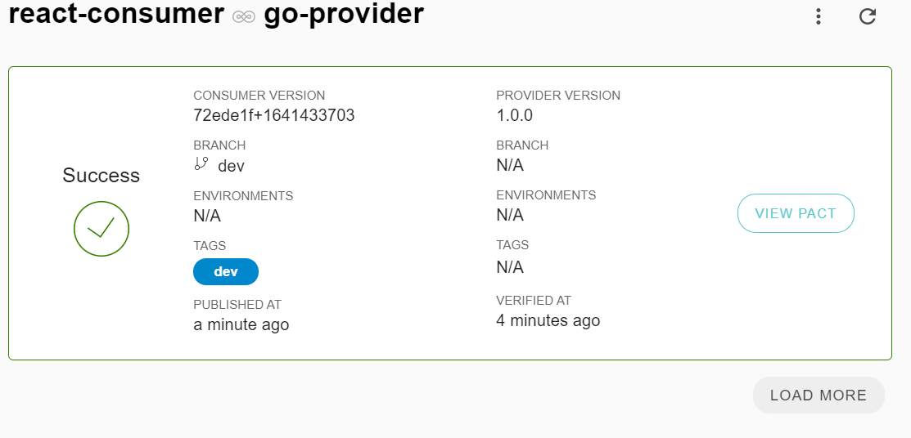
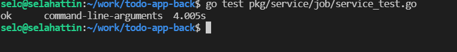

# todo-app-back

## For The General Project

I learned how to write tests and the logic of tests. I realized that the TDD part should actually be in every project. I have done the parts so far in about 2.5 days. I've read a lot of sources.

Maybe I could have done better if I had time to try a little harder. I am sending the project as it is because there are 2 important works/homework that I have to do.

```
├─ bin                           //The folder where the binary file was created
├─ cmd                           //The code that started it all
├─ config.yml                    //Config showing which information the backend server will run
├─ go.mod                        //3rd party libraries
├─ go.sum                        //Sums and versions of 3rd party libraries
├─ makefile                      //MakeFile for version control ,creation of binary file tests 
└─ pkg                           //Server codes 
   ├─ api                        //Api Layer for all aplication
   ├─ model                      //Models for every type of object
   ├─ repository                 //DB Layer
   │  ├─ todo
   ├─ server                     //Server Layer for all aplication. Main part of http server
   ├─ service                    //Service Layer
   │  ├─ todo
   ├─ static                     //Auto generated static files
   └─ version                    //Version control&save for git

```

## ⚡️ Quick start

First of all, [download](https://golang.org/dl/) and install **Go**. :)

## Pre-Req
> mysql #Check config.yml

## For build

```bash
make build
```
## For Test
It only contains pact test. For this project I use pactflow. In backend, I did not write **any unit tests** 
```bash
make test
```
## CI/CD Pipline
The ci/cd pipline part is working properly. If I have to explain the part I've done so far, the build and dockerize parts are working in a single workflow.

While running the tests in circle ci I encountered errors and could not fix them. The reason for these errors is:
>exec: "pact-provider-verifier": executable file not found in $PATH

I couldn't solve this problem even though I tried to add it as a docker image. That's why I couldn't do the automation part of the process.

#### A few images about pact tests






